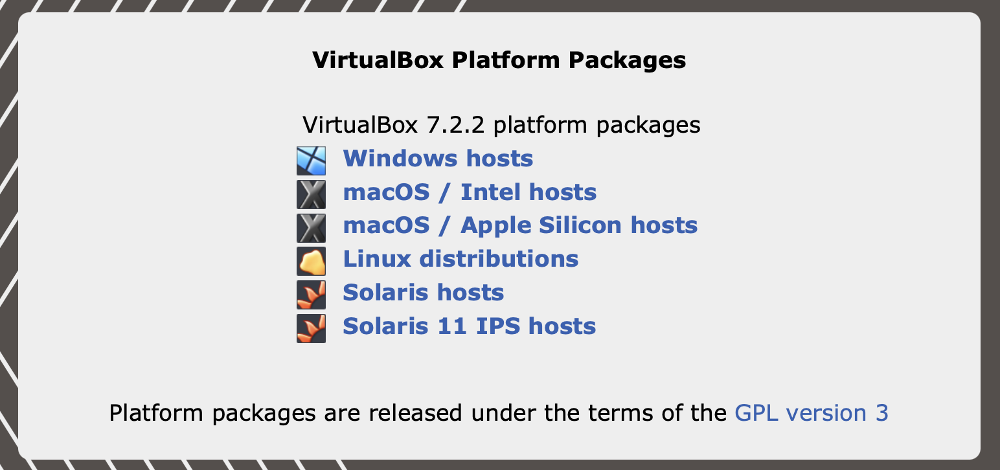
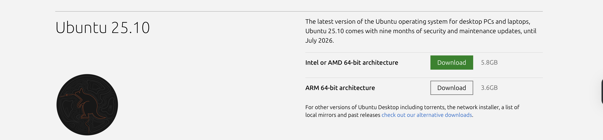
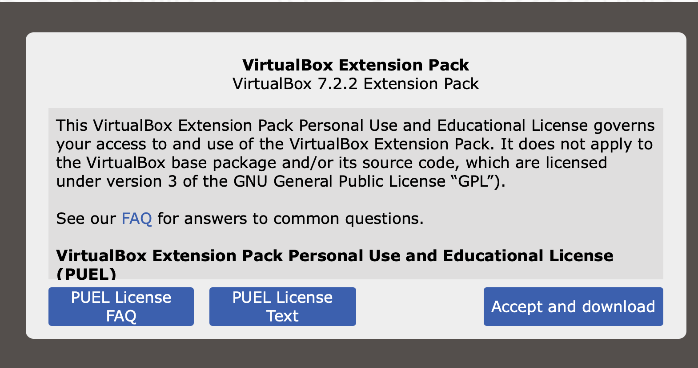
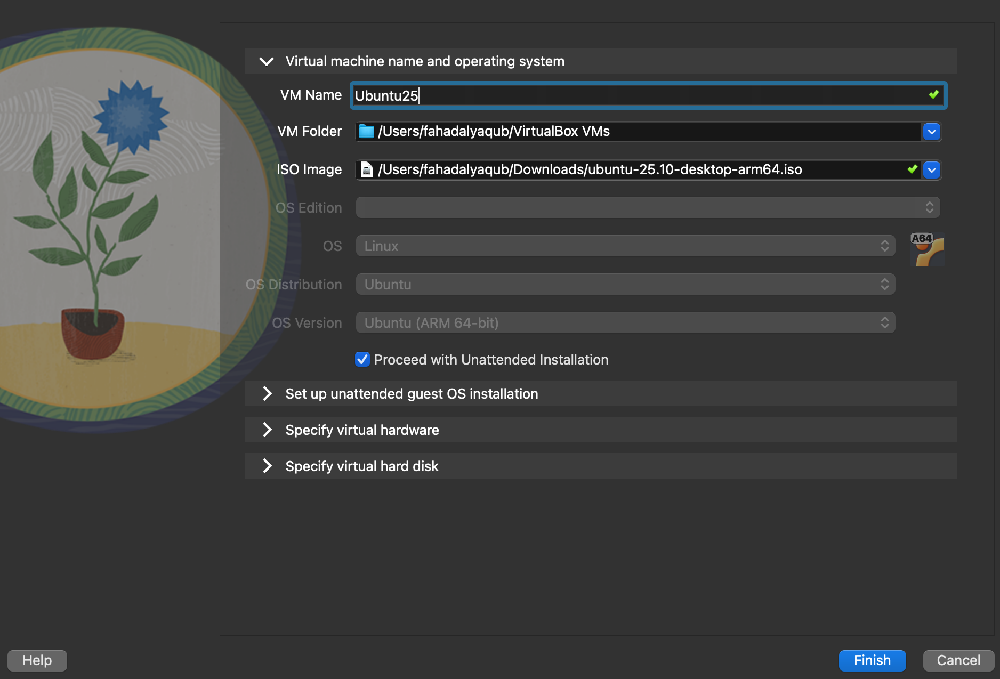
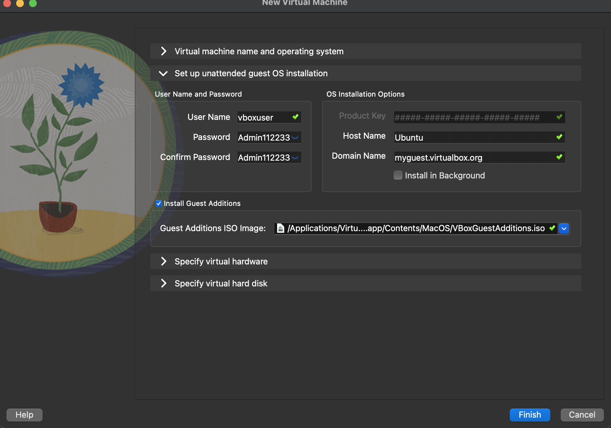
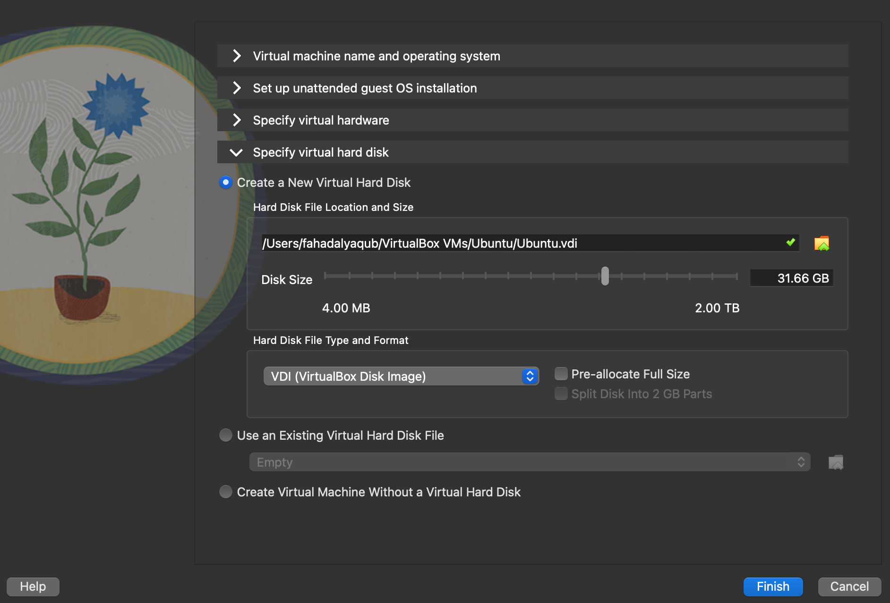

# Introduction to Linux

Linux is an open-source operating system that serves as the backbone for a wide variety of devices, from servers and supercomputers to personal computers and smartphones.

One of the defining features of Linux is its command-line interface (CLI), which allows users to interact with the system using text-based commands. While many Linux distributions offer graphical user interfaces (GUIs), understanding and using the command line is essential for unlocking the full potential of Linux.

## Why It's Important to Learn Linux Commands

1. **Efficiency and Speed**: Command-line operations can often be faster than navigating through graphical interfaces, especially for repetitive tasks. Skilled users can execute complex commands quickly and efficiently.

2. **Automation and Scripting**: Learning Linux commands enables users to write scripts that automate routine tasks, saving time and reducing the likelihood of human error.

3. **System Administration**: Many system administration tasks, such as managing users, configuring network settings, and monitoring system performance, are performed more effectively through the command line.

4. **Remote Management**: Linux commands are essential for managing servers and systems remotely via tools like SSH (Secure Shell), allowing for administration without needing physical access to the machines.

5. **Problem-Solving**: Many troubleshooting tasks require knowledge of Linux commands. Understanding how to navigate the system and check logs can help diagnose and resolve issues more effectively.

Learning Linux commands not only enhances your technical skills but also opens up a world of opportunities in the rapidly evolving tech landscape. Whether you're a developer, IT professional, or enthusiast, mastering the command line is a crucial step toward becoming proficient in Linux. 

## Linux Distributions 
Linux is an open-source operating system; it is open for alteration, modification, and distribution. Therefore, it has multiple distributions, each of which bundles the Linux kernel with software programs and utilities to serve specific purposes. 

One of these distributions is **Ubuntu**, which is the one we will be using, as it is a simple, user-friendly, and general-purpose distribution. Unlike Kali Linux, which is bundled with software and utilities for security purposes and penetration testing.
## What is VirtualBox?

VirtualBox is a powerful open-source virtualization software developed by Oracle. It allows users to create and manage virtual machines (VMs) on their computer, enabling the running of multiple operating systems simultaneously on a single physical machine. VirtualBox runs on major operating systems, including Windows, macOS, Linux, and Solaris. This cross-platform compatibility allows users to run different OS environments on their native systems, and we will use it to install Linux OS.


## Installing Ubuntu 25 on Mac using VirtualBox

This guide will walk you through installing Ubuntu 25 on an M-series MacBook using VirtualBox.    

>[!NOTE]
> Choose the suitable architecture based on your device. 
In our case, the device architecture is **ARM 64-bit architecture**.

## Step 1: Download Required Files

### Download VirtualBox for macOS ARM64
1. Go to the [VirtualBox downloads page](https://virtualbox.org/wiki/Downloads).
2. Under **VirtualBox Platform Packages**, click on **macOS / Apple Silicon hosts** to download the ARM64 installer (e.g., `VirtualBox-7.1.8-166488-macOSArm64.dmg`). Save this `.dmg` file to your Desktop as well.



### Download the Ubuntu 25.04 ISO
1. Open a web browser and navigate to the official [Ubuntu download page](https://ubuntu.com/download/desktop).
2. Scroll down to locate **Ubuntu 25.04** and click the **Download** button under **ARM 64-bit architecture**. This will download the `ubuntu-25.04-desktop-arm64.iso` file. Save it to your Desktop (or another easily accessible folder).



## Step 2: Install VirtualBox
1. Locate the downloaded `VirtualBox-7.1.8-166488-macOSArm64.dmg` on your Desktop and double-click it to open the disk image.
2. Inside the mounted disk image, double-click the `VirtualBox.pkg` installer icon to start the installation wizard.
3. Follow the on-screen instructions in the installer:
   - Click **Continue** on the introduction screen.
   - Review the software license and click **Continue**, then **Agree** to accept the terms.
   - Select the installation destination and click **Install**.
   - Enter your macOS administrator password when prompted, then click **Install Software** to proceed.
   - Wait for the installation process to complete. This will install VirtualBox 7.1.8 (or the version you downloaded) onto your Mac.
   - When the installation finishes, you’ll see a completion message. Click **Close** to exit the installer.
VirtualBox is now installed on your system. You can find it in the **Applications** folder. 


4. Download VirtualBox Extension Pack **(Optional)**, which is for personal use, and the Educational License governs your access to and use of it . 
To download it, go to [VirtualBox Extension Pack](https://www.virtualbox.org/wiki/Downloads).    


After installing the Extension Pack into your VirtualBox by dragging the extention to the opened VirtualBox application, you can close the VirtualBox Manager for now. The extension features will be available to any virtual machines you create.

## Step 3: Create the Ubuntu Virtual Machine
Now it’s time to create a new virtual machine for Ubuntu. Open VirtualBox Manager if it’s not already open, and follow these steps:
1. Click the **New** button: In the VirtualBox Manager, click **New** (or press **Cmd+N**) to start the VM creation wizard.
2. Name and OS settings:
   - Enter a name for your VM (e.g., “Ubuntu25”). The folder location for the VM files will be suggested; you can change it if desired.
   - Click the **ISO Image** dropdown and select **Other…**. Navigate to your Desktop and select the `ubuntu-25.04-desktop-arm64.iso` file you downloaded. This attaches the Ubuntu ISO to the VM for installation.
   - Ensure the **Type** is set to **Linux** and the **Version** is set to **Ubuntu (ARM 64-bit)**.
   - Uncheck the “Skip Unattended Installation” option (we will use the unattended install feature to automate setup).    


3. Unattended Installation settings (auto-fill):
   - In the **Unattended Install** tab, enter your desired **Username** and **Password** for the Ubuntu system.
   - Re-type the password to confirm.
   - Make sure the **Guest Additions** checkbox is checked. The path for the Guest Additions ISO should automatically point to the correct location on your Mac.


4. Hardware settings:
   - **Base Memory (RAM)**: Allocate around **4096 MB (4 GB)** of memory to the VM.
   - **Processors (CPUs)**: Allocate **4 CPUs** to the VM.
   - **Enable EFI**: Check the box for “Enable EFI (special OSes only)”.
   - Click **Next** to configure the virtual hard disk.


5. Finish VM creation:
   - Click **Finish** to create the virtual machine. The new VM (e.g., “Ubuntu 25”) should now appear in the VirtualBox Manager list.

## Step 4: Initial Ubuntu Boot and Installation
1. Start the VM: In VirtualBox Manager, select your Ubuntu VM and click **Start**
2. Enlarge the VM window (if needed): Go to the VirtualBox menu bar at the top of your screen, click **View**, and select **Scaled Mode**.
3. Select the installation option: Use the arrow keys to highlight **Try or Install Ubuntu** and press **Enter**.
4. Wait for the installer to load: The Ubuntu desktop will appear in the VM. After a few moments, the **Install Ubuntu 25.04** wizard should launch automatically.
5. Follow the installation prompts:
   - **Welcome screen**: Select your preferred language and click **Continue**.
6. Installation process: The installer will now copy files and install Ubuntu on the virtual disk. This process will take approximately **15 minutes** to complete.
7. Restart the VM: Click **Restart Now** to reboot into the newly installed Ubuntu system. If prompted to “Please remove the installation medium,” press **Enter** to continue.

## Step 5: Start Ubuntu and Initial Setup
1. Log in to Ubuntu: The login screen will appear. Click on your username and enter the password you created. Press **Enter**.
2. Welcome to Ubuntu: The Ubuntu 25.04 Welcome wizard may launch. Follow the prompts or click **Next** through the screens.
3. Desktop access: You should now see the Ubuntu desktop. Familiarize yourself with the interface.

## Step 6: Update Ubuntu
1. Open the Terminal: Press **Ctrl+Alt+T** or search for **Terminal** in the applications menu.
2. Run the update commands:
   ```bash
   sudo apt update && sudo apt upgrade -y
   ```
>[!NOTE]
> #### Step-by-step tutorial
> Resource: [Installing Ubuntu and VirtualBox on MAC](https://www.youtube.com/watch?v=j50F4QjqoVM).  

## Install Ubuntu and VirtualBox on Windows
Resource: [Installing Ubuntu and VirtualBox on Windows](https://www.youtube.com/watch?v=j50F4QjqoVM). 

